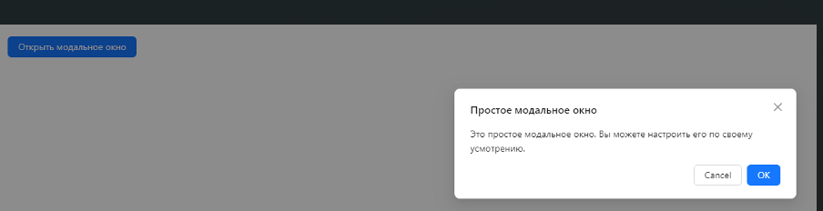
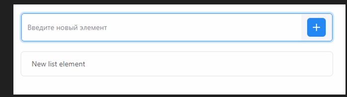

Создание простого React приложения с использованием Ant Design. При возникновении трудностей обратитесь к документации Ant Design

1.Настройка проекта

○Создайте новое приложение при помощи Create React App.
○В терминале, находясь в папке проекта, выполните команду для установки пакета Ant Design: npm install antd.

1.Создание структуры приложения

○В компоненте `App` импортируйте необходимые компоненты Ant Design, такие как `Button` и `Modal`.
○Создайте состояние для управления видимостью модального окна.
○Реализуйте функции для открытия и закрытия модального окна.
○Добавьте кнопку, при нажатии на которую будет открываться модальное окно.
○Добавьте модальное окно с текстом и кнопками для закрытия.

Создание простого React приложения с использованием React Suite.
При возникновении трудностей обратитесь к документации Suite 

1.Настройка проекта

○Создайте новое приложение при помощи Create React App.
○В терминале, находясь в папке проекта, выполните команду для установки пакета React Suite: npm install rsuite.

1.Создание структуры приложения

○В компоненте `App` импортируйте необходимые компоненты React Suite, такие как `Button`, `List`, `Input`, `InputGroup`, и `IconButton`.
○Создайте состояние для хранения списка элементов и нового вводимого элемента.
○Реализуйте функции для добавления нового элемента в список.
○Добавьте поле ввода и кнопку для добавления нового элемента.
○Отобразите список элементов с помощью компонента `List`.

3.   Запуск приложения

○Сохраните изменения в файлах.
○Запустите приложение, проверьте его работоспособность.

4.    Должно получиться

○InputGroup: Группа для объединения поля ввода и кнопки.
○Input: Поле ввода для ввода нового элемента.
○IconButton: Кнопка с иконкой для добавления нового элемента.
○List: Компонент для отображения списка элементов.
