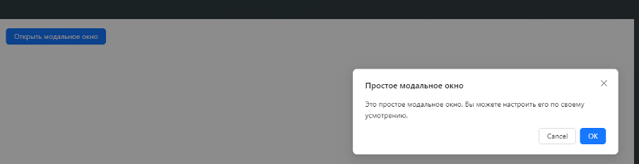

Создание простого React приложения с использованием Ant Design. При возникновении трудностей обратитесь к документации Ant Design

1.Настройка проекта

○Создайте новое приложение при помощи Create React App.
○В терминале, находясь в папке проекта, выполните команду для установки пакета Ant Design: npm install antd.

1.Создание структуры приложения

○В компоненте `App` импортируйте необходимые компоненты Ant Design, такие как `Button` и `Modal`.
○Создайте состояние для управления видимостью модального окна.
○Реализуйте функции для открытия и закрытия модального окна.
○Добавьте кнопку, при нажатии на которую будет открываться модальное окно.
○Добавьте модальное окно с текстом и кнопками для закрытия.
