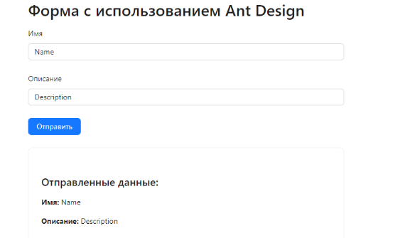

Домашняя работа 19

Задание

Создание React приложения с использованием Ant Design.

При возникновении трудностей обратитесь к документации Ant Design - https://ant.design/

Создание нового React приложения

Создайте новое React приложение при помощи Create React App.

В терминале, находясь в папке проекта, выполните команду для установки пакета Ant Design: npm install antd

Создание структуры приложения

В компоненте `App` используйте хуки `useState` для управления состоянием формы и отображаемых данных.

Импортируйте необходимые компоненты из Ant Design, такие как `Form`, `Input`, `Button`, `Card`, и `Typography`.

Создайте форму с полями ввода для имени и описания.

Добавьте кнопку для отправки формы.

Реализуйте функцию для обновления состояния полей ввода при их изменении.

Реализуйте функцию для обработки отправки формы и отображения введенных данных в карточке (Card).

Запуск приложения

Сохраните изменения в файлах.

Запустите приложение, проверьте, что всё работает и выглядит так, как должно.

Результат

Получившееся React приложение должно включать:

Форма: Для ввода имени и описания.

Кнопка: Для отправки формы.

Карточка (Card): Для отображения отправленных данных.

При отправке формы введенные данные будут отображаться под формой в карточке.

import React, { useState } from 'react';

import { Form, Input, Button, Card, Typography } from 'antd';

const { Title } = Typography;

function App() {

const [formData, setFormData] = useState({ name: '', description: '' });

const [submittedData, setSubmittedData] = useState(null);

const handleInputChange = (e) => {

    const { name, value } = e.target;

    setFormData({

      ...formData,

      [name]: value,

    });

};

const handleSubmit = () => {

    setSubmittedData(formData);

};

return (

    

      <Title level={2}>Форма с использованием Ant Design</Title>

      <Form layout="vertical">

        <Form.Item label="Имя">

          <Input

            name="name"

            value={formData.name}

            onChange={handleInputChange}

            placeholder="Введите ваше имя"

          />

        </Form.Item>

        <Form.Item label="Описание">

          <Input

            name="description"

            value={formData.description}

            onChange={handleInputChange}

            placeholder="Введите описание"

          />

        </Form.Item>

        <Form.Item>

          <Button type="primary" onClick={handleSubmit}>

            Отправить

          </Button>

        </Form.Item>

      </Form>

      {submittedData && (

        <Card style={{ marginTop: '20px' }}>

          <Title level={4}>Отправленные данные:</Title>

          
<strong>Имя:</strong> {submittedData.name}

          
<strong>Описание:</strong> {submittedData.description}

        </Card>

      )}

    

);

}

export default App;

